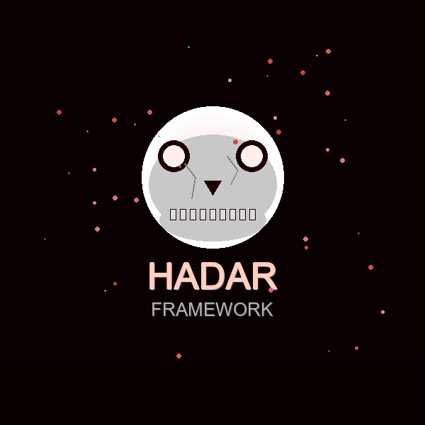

<div align="center">
  
  <h1 style="color: #cc0000;">HADAR FRAMEWORK</h1>
  <p><em>Android Remote Administration Tool</em></p>
</div>

<br>

<p align="center">
  
  
  
  
</p>

---

## Acerca de

**Hadar Framework** es una herramienta de administración remota para Android (RAT) diseñada para profesionales de seguridad. Permite gestionar dispositivos Android de forma remota con fines educativos y de pruebas de penetración.

> **Advertencia:** Esta herramienta es solo para fines educativos y pruebas de seguridad autorizadas. El mal uso puede tener consecuencias legales.

---

## Características

- Construcción de payloads APK standalone
- Binding de payloads en APKs existentes
- Panel de control de víctimas en tiempo real
- Módulos: Cámara, Micrófono, SMS, Contactos, Ubicación, Archivos, Llamadas
- Permisos configurables para Android 12+

---

## Requisitos

| Componente | Versión |
|------------|---------|
| Node.js | 10.x - 18.x |
| Java | 8 - 21 |
| Apktool | Incluido |
| Gradle | 8.5 |
| Android SDK | 34 |

---

## Instalación

```bash
# Clonar el repositorio
git clone https://github.com/CarlosConcepcion/Hadar-Framework.git

# Entrar al directorio del servidor
cd Hadar-Framework/Hadar-Server

# Instalar dependencias
npm install

# Iniciar
npm start
```

---

## Uso

1. Abre el servidor y ve a la pestaña **APK Builder**
2. Configura la IP y puerto del servidor
3. Selecciona los permisos deseados
4. Construye el payload (standalone o bound)
5. Instala el APK en el dispositivo víctima
6. Conéctate desde el **Victim's Lab**

---

## Construcción desde código fuente

### Cliente Android
```bash
cd Hadar-Client
./gradlew assembleRelease
```

### Servidor
```bash
cd Hadar-Server
npm install
npm run build
```

---

## Estructura del proyecto

```
Hadar-Framework/
├── Hadar-Client/          # Código fuente del payload Android
│   └── app/src/main/java/com/hadar/framework/
├── Hadar-Server/          # Servidor Electron + Node.js
│   └── app/
│       ├── assets/        # Frontend (AngularJS)
│       └── Factory/       # Payload base (apktool, smali)
└── .github/               # Workflows, templates, assets
```

---

## Licencia

Este proyecto está licenciado bajo MIT.

---

<div align="center">
  <p><strong>Hadar Framework</strong> — Creado con ❤️ para la comunidad de seguridad.</p>
</div>
